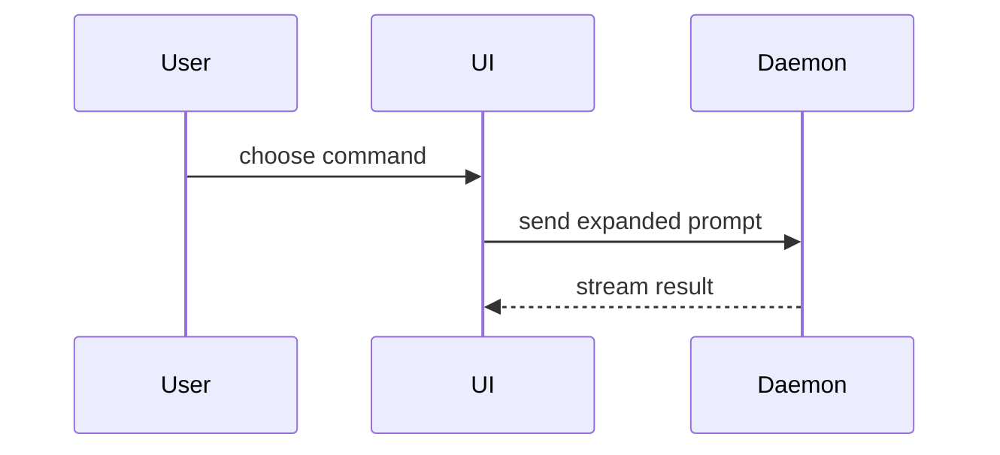

# Show Me

Help the reader understand the current change visually. Skip the preamble and keep
prose brief. Pick the smallest view that makes the key point clear, and place each
visual next to the short text it supports.

In Socratic Garden the output is a document, so favour views that render inline in
Markdown — fenced `mermaid`, `diff`, `text`, and language code blocks. These belong
in the design doc itself, next to the decision they illustrate, not as a separate
gallery.

## Views you can reach for

- Show logic or an algorithm as pseudocode:

```text
on(save)
  if content is unchanged
    return cached result
  write new content
  return fresh result
```

- Show runtime control flow as a call tree:

```text
submitForm
  createSession
    persistPrompt
    launchAgent
  navigateToSession
```

- Show UI structure as a component tree, including state and module boundaries that matter:

```tsx
<SessionPage> (apps/example/src/routes/session.tsx)
  useSessionEvents()
  <SessionToolbar>
    <RunSkillButton> (packages/ui)
```

- Show file responsibility or a broad refactor as a shallow file tree:

```text
src/
├── commands/       # parses user actions
├── sessions/       # owns session state
└── transport/      # sends API requests
```

- Show component interaction, control flow, or data flow with Mermaid:



- Use `diff` when the point is what changes and the surrounding shape already exists. Match the diff shape to the topic.

For a component change:

```diff
 <SessionPage>
   useSessionEvents()
   <SessionToolbar>
+    <RunSkillButton />
   <SessionTimeline>
+    <SkillResultCard />
```

For a file-layout change:

```diff
 src/
 ├── commands/
+│   └── show-me.ts       # expands the slash command
 ├── sessions/
-└── transport.ts
+└── transport/
+    ├── client.ts
+    └── stream.ts
```

For a call-tree or call-stack change:

```diff
 submitForm
   createSession
     persistPrompt
+    expandSkillMention
     launchAgent
-  navigateToSession
+  navigateToSession
+    subscribeToEvents
```

For a state or control-flow change:

```diff
 on(save)
-  write content
+  if content is unchanged
+    return cached result
+  write new content
+  invalidate cache
```

- Show the whole block when most of it is new, when omitted context would hide ownership or order, or when the reader needs a copyable target shape:

```ts
function expandSkill(command: string): string {
  const skillName = command.slice(1)
  return `use the ${skillName} skill`
}
```

- For a visual UI, layout, state comparison, or concept too dense for Mermaid or a
  code fence, write one focused HTML file — a diagram, an infographic, or a short
  slide deck, whichever fits the point. Match the product's colours, type, spacing,
  and components; use real labels and data; support desktop and mobile. Reference it
  from the doc; open it only if the environment has a shell available.

## Surfaces a design doc usually needs

Beyond the primitives above, a design change is easier to trust when the reader can
see exactly what it adds or moves. Draw only the ones this change actually touches:

- **Stack traces, and stack-trace diffs.** When the change alters an error path or a
  call stack, show the trace as a `text` block, and use a `diff` to show how the
  frames change — what is added, removed, or reordered:

```diff
 ValidationError: prompt is empty
   at expandSkill (skills.ts:12)
-  at submitForm (form.ts:88)
+  at expandSkillMention (skills.ts:31)
+  at submitForm (form.ts:88)
```

- **Lists of new and modified files.** Give the reader a shallow tree or a short
  table that separates what is created from what is edited, so the blast radius is
  visible at a glance:

```text
new:      src/transport/stream.ts
new:      src/skills/show-me.ts
modified: src/commands/index.ts      # register the command
modified: src/sessions/session.ts    # thread the new event
```

- **New surfaces — the contracts other code depends on.** Show the added or changed
  interface, not its implementation, so reviewers can weigh compatibility:
  - API contracts (endpoint, method, request/response shape, error semantics),
  - Go / TypeScript / Python interfaces and types,
  - function or method signatures,
  - database schema changes.

  Prefer the target shape, and a `diff` when an existing surface changes:

```ts
// TypeScript interface — new surface
interface SkillResult {
  name: string
  output: string
  durationMs: number
}
```

```diff
 CREATE TABLE session (
   id           TEXT PRIMARY KEY,
-  prompt       TEXT NOT NULL
+  prompt       TEXT NOT NULL,
+  skill_result TEXT
 );
```

## Guidance

Keep only the calls, files, props, states, frames, and surfaces needed to answer the
reader's current question or to resolve the decision at hand. You may use one of
these views, you may use several; it is unlikely you will use all of them. Use your
judgement and don't overwhelm the reader.

---

## Attribution

This skill is adapted from **show-me** by HumanLayer, part of
[humanlayer/skills](https://github.com/humanlayer/skills)
(`plugins/show-me/skills/show-me/SKILL.md`), used under the MIT License. The full
license text is in [LICENSE](./LICENSE) alongside this file.
